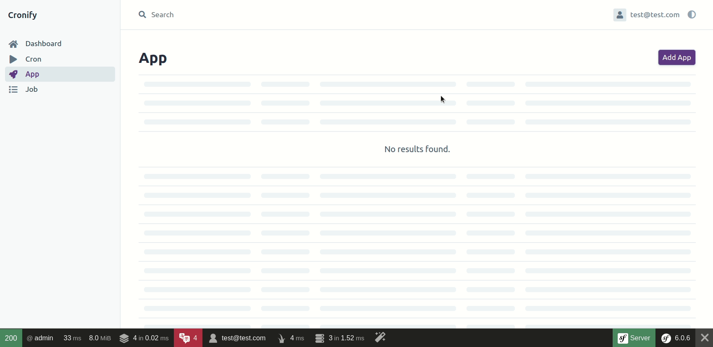
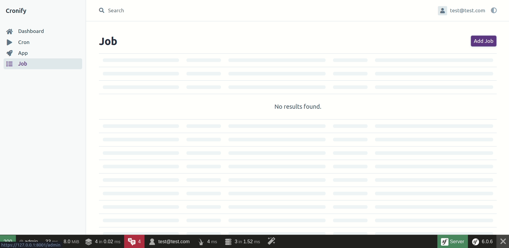
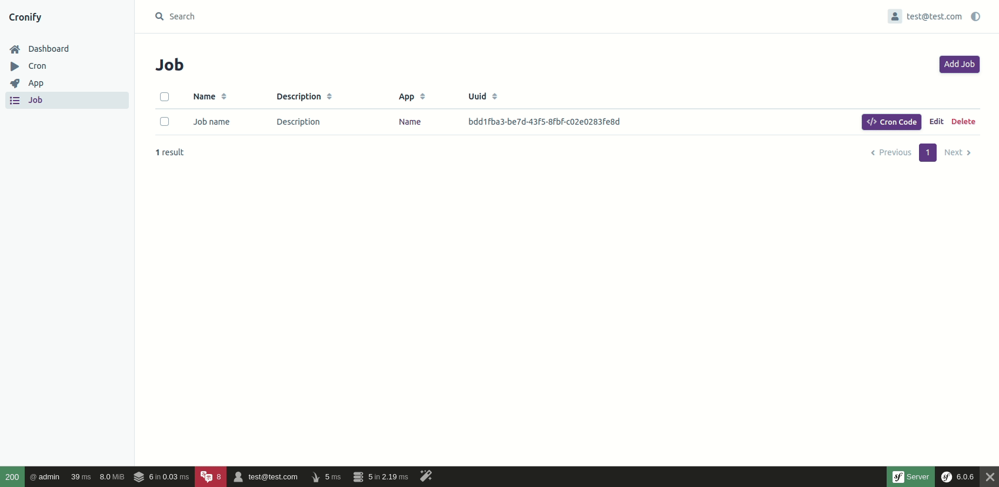

# Cronify

Simply monitor your Cron

[](https://github.com/yoanbernabeu/cronify/actions/workflows/ci.yml) [](LICENSE)


---

##  1. <a name='TableofContents'></a>Table of Contents

<!-- vscode-markdown-toc -->
* 1. [Table of Contents](#TableofContents)
* 2. [What is cronify ?](#Whatiscronify)
* 3. [How to install the app ?](#Howtoinstalltheapp)
	* 3.1. [Prerequisites](#Prerequisites)
	* 3.2. [Clone and install](#Cloneandinstall)
	* 3.3. [Create a new User](#CreateanewUser)
* 4. [How to use ?](#Howtouse)
	* 4.1. [Create a new App](#CreateanewApp)
	* 4.2. [Create a new Job](#CreateanewJob)
	* 4.3. [Get Cron Code snippet](#GetCronCodesnippet)
* 5. [How to quickly test Cronify?](#HowtoquicklytestCronify)
	* 5.1. [ Create a docker-compose.yml](#Createadocker-compose.yml)
	* 5.2. [Start containers](#Startcontainers)
	* 5.3. [Launch your browser and have fun !](#Launchyourbrowserandhavefun)
* 6. [ Build your own Docker image](#BuildyourownDockerimage)
* 7. [License](#License)

<!-- vscode-markdown-toc-config
	numbering=true
	autoSave=true
	/vscode-markdown-toc-config -->
<!-- /vscode-markdown-toc -->

---

##  2. <a name='Whatiscronify'></a>What is cronify ?

Cronify is a simple tool to monitor the execution of your cron jobs.

The use is super simple:
1. Declare one or more applications
2. Declare one or more jobs for your applications
3. For each job, you only have to touch three addresses to log the execution:
    - An address to start a cron
    - An address to stop a cron
    - An address to indicate an error

##  3. <a name='Howtoinstalltheapp'></a>How to install the app ?

Cronify is a simple Symfony/PHP/PostgreSQL application.

This documentation offers a simplified installation FOR DEVELOPMENT ONLY with Docker. You can do without it if you already have PostgreSQL.

###  3.1. <a name='Prerequisites'></a>Prerequisites

- [PHP 8.1](https://www.php.net/downloads.php)
- [Composer](https://getcomposer.org/)
- [Docker](https://www.docker.com/)
- [Make](https://www.gnu.org/software/make/)
- [Symfony CLI](https://symfony.com/download)

###  3.2. <a name='Cloneandinstall'></a>Clone and install

```bash
git clone https://github.com/yoanbernabeu/Cronify.git
cd Cronify
make install
```

###  3.3. <a name='CreateanewUser'></a>Create a new User

User creation is possible from the command line.

```bash
symfony console app:create-user username@mail.com password
```

##  4. <a name='Howtouse'></a>How to use ?

Only THREE steps to get your cron job monitoring addresses !

###  4.1. <a name='CreateanewApp'></a>Create a new App



###  4.2. <a name='CreateanewJob'></a>Create a new Job



###  4.3. <a name='GetCronCodesnippet'></a>Get Cron Code snippet



##  5. <a name='HowtoquicklytestCronify'></a>How to quickly test Cronify?

We offer you a quick method to test the application with the use of a preconfigured Docker container.

###  5.1. <a name='Createadocker-compose.yml'></a> Create a docker-compose.yml

```yaml
version: '3'

services:
  database:
    image: postgres:${POSTGRES_VERSION:-13}-alpine
    environment:
      POSTGRES_DB: ${POSTGRES_DB:-app}
      POSTGRES_PASSWORD: ${POSTGRES_PASSWORD:-ChangeMe}
      POSTGRES_USER: ${POSTGRES_USER:-symfony}
    volumes:
      - db-data:/var/lib/postgresql/data:rw

  app:
    image: yoanbernabeu/cronify:latest
    ports:
      - "8080:80"
    environment:
      DATABASE_URL: postgres://${POSTGRES_USER:-symfony}:${POSTGRES_PASSWORD:-ChangeMe}@database:5432/${POSTGRES_DB:-app}

volumes:
  db-data:
```

###  5.2. <a name='Startcontainers'></a>Start containers

```bash
docker-compose up -d
```

###  5.3. <a name='Launchyourbrowserandhavefun'></a>Launch your browser and have fun !

- Go to http://localhost:8080
- Login with :
	- username: demo@demo.com
	- password: password

##  6. <a name='BuildyourownDockerimage'></a> Build your own Docker image

If you want to build your own Docker image, we provide a make command that you **need to adapt to your context**.

*Do not run the command without modifications, you would not have the rights to upload the image to the Docker Hub.*

```bash
make docker-build-and-push
```

##  7. <a name='License'></a>License

See the bundled [LICENSE](LICENCE) file.